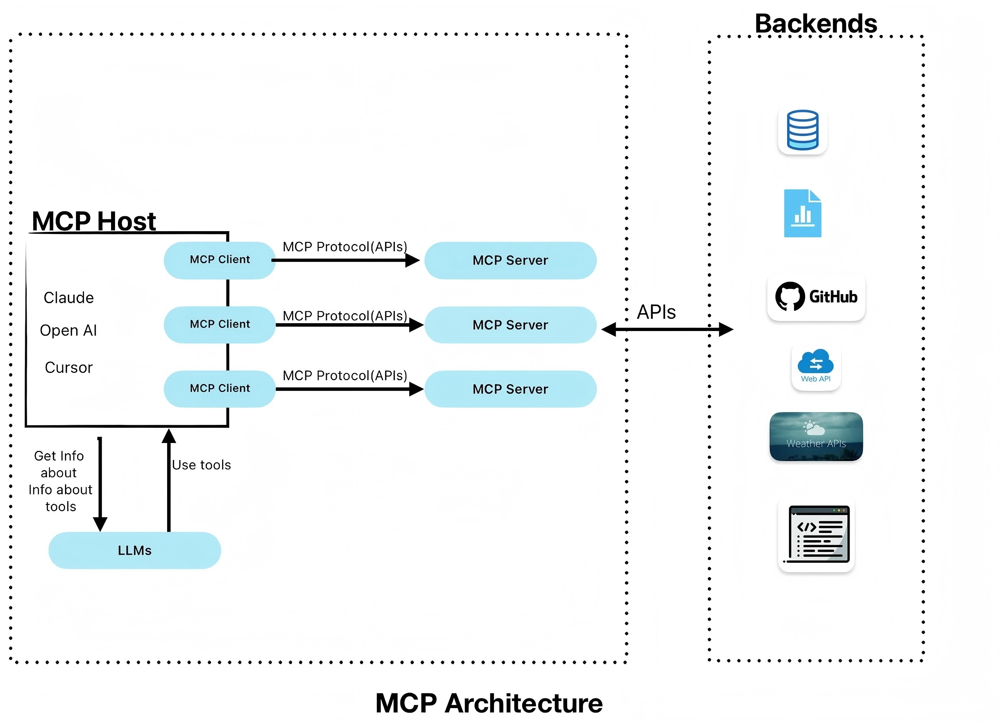

# 一、MCP是什么

把小智AI比作是大脑，MCP就是小智的五官和手脚，使得小智具备感知世界，改造世界的能力。有了MCP，小智就能成为真正的贾维斯。
因为MCP的出现，使得各种功能的mcp-server很容易开发和复用，形成工具箱，拿来即用，大大降低了智能体的开发难度。
# 二、MCP的通信机制
MCP 使用 JSON-RPC 2.0 作为其网络传输的数据格式，
## stdio
mcp-server在本地部署，也就是说mcp-server和mcp-client在同一台机器上部署，双方通过标准输入输出进行通信，目前主流的方式，优势是通信延迟低。
## sse
mcp-server可以在远程部署，mcp-server和mcp-client可以在不同机器上部署，底层通过http协议进行通信。
sse用于在web应用中实现服务器向客户端推送实时数据的功能，它是单向通信。在mcp中为了实现双向通信，增加了/messages接口，客户端通过HTTP POST方法向服务端/messages接口发送数据。优势是部署灵活，可扩展性和容灾能力更强。  
                      
mcp-client       <---        mcp-server(/sse)  
mcp-client       --->        mcp-server(/messages)  

[示例代码](https://modelcontextprotocol.io/docs/concepts/transports#python-server )
# 三、MCP-proxy
[代码链接](https://github.com/sparfenyuk/mcp-proxy?tab=readme-ov-file#11-configuration)

作用是stdio<->sse的双向代理  
mcp-client【stdio】 <--->【stdio】 mcp-proxy 【sse】<---> 【sse】mcp-server（Homeassistant）  
mcp-client【sse】<--->【sse】mcp-proxy【stdio】<--->【stdio】mcp-server
# 四、xiaozhi-server MCP原理
### 工作流
- 支持MCP-proxy的工作流
- 支持直连MCP-server，sse不支持access_key，我已经修改OK。
xiaozhi-server【stdio/sse】<--->【stdio/sse】mcp-server

### 代码讲解
每一个xiaozhi终端连接到xiaozhi-server的websocket后，xiaozhi-server会维护一个连接，这个连接会根据控制台上配置的信息进行通用和个性功能初始化。
- 初始化流程：  
WebSocketServer(_handle_connection)--->ConnectionHandler(handle_connection)--->MCPManager(initialize_servers)初始化所有的mcp-client和mcp-server对--->MCPClient

- 请求流程：  
startToChat ---> chat_with_function_calling ---> response_with_functions ---> getMessages

- MCPManager:  
tools1 ---> mcp-client1  <---> mcp-server1  
tools2 ---> mcp-client2  <---> mcp-server2

Homeassistant是sse的实现，所有教程都是将mcp-client配置成用stdio+mcp_proxy的方式实现连接server，是否能用SSE直接连？xiaozhi-server虽然支持stdio和sse两种mcp-server，但是sse方式不支持access_key，无法通过配置连接Homeassistant。如果修改代码支持sse直连？
# 五、虾哥MCP原理
[代码链接](https://github.com/78/mcp-calculator/tree/main)

xiaozhi-server(虾哥)【websocket】<---> 【websocket】mcp_pipe.py【stdio】<--->【stdio】mcp-server

- mcp_pipe.py充当代理的功能，建立xiaozhi-server的私有数据通道和代理转发功能
- 目前mcp_pipe.py只支持stdio的mcp-server，sse不支持，homeassistant的mcp-server无法使用。
